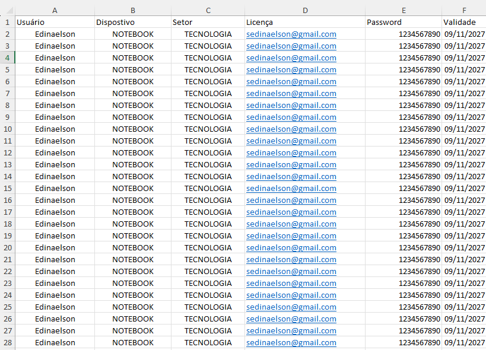
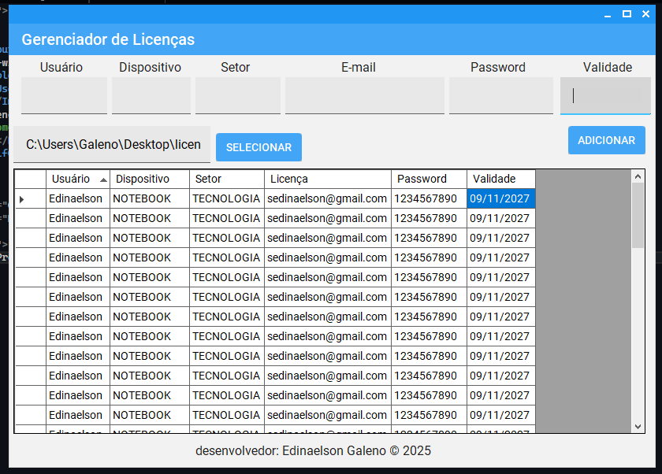

# Gerenciador de Licenças

# Descrição

O Gerenciador de Licenças um aplicativo Windows Forms desenvolvido em C# e .NET 8, projetado para facilitar o armazenamento e a gestão de licenças de software. Ele permite que o usuário adicione, visualize e exporte dados para um arquivo Excel (.xlsx).

## Funcionalidades

> Interface simples e intuitiva.

> Adição de novos registros de licença.

> Exportação de dados para Excel.

> Carregamento de arquivos de licença.

> Exibição de dados em formato tabular.

## Tecnologias Utilizadas

> Linguagem: C#

> Framework: .NET 8 (Windows Forms)

### Bibliotecas:

> ClosedXML para manipulação de arquivos Excel.

> MaterialSkin.2 para estilização da interface.

## Capturas de Tela

> Interface do Aplicativo

> 
> 

## Exportação para Excel

 > 1- Como Executar

Requisitos

> 2- .NET 8 instalado

> 3- Windows 10 ou superior

## Executando o Aplicativo

Baixe o repositório e extraia os arquivos.

No terminal, navegue até a pasta do projeto e execute:

> `dotnet publish -c Release -r win-x64 --self-contained true -p:PublishSingleFile=true`

O executável estará disponível em bin\Release\net8.0-windows\win-x64\publish\.

Execute o arquivo .exe gerado para abrir o aplicativo.

### Desenvolvedor

> ## Edinaelson Galeno © 2025

